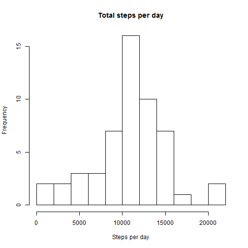
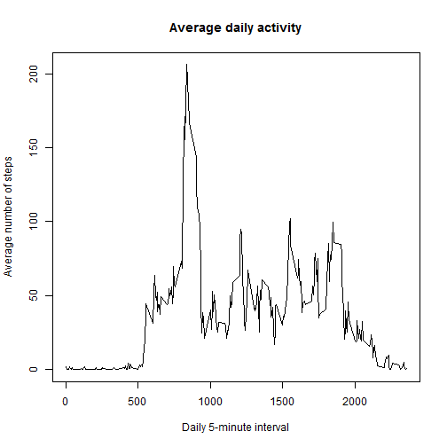
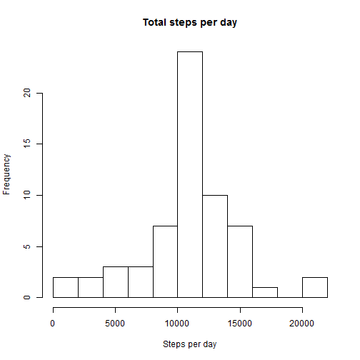
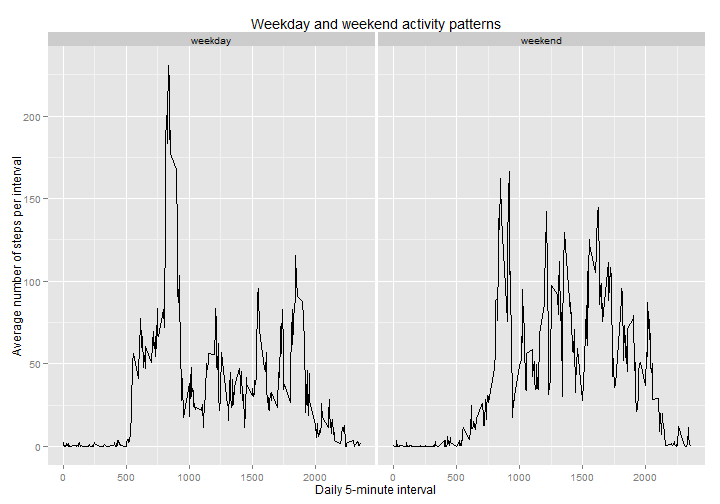

Note: Not setting the working directory correctly produced errors for me. This is my personal working directory and had to be set for the code to process correctly.

```r
setwd("D:/D Documents/Coursera/Reproducible research")
```

## Loading the data.
  This assignment makes use of data from a personal activity monitoring device. The data can be found at
[Activity monitoring data][1]. Assuming that the data is in the working directory the data is first unzipped and read into R. The data format is as follows,

- **steps:** Number of steps taking in a 5-minute interval (missing values are coded as NA)

- **date:** The date on which the measurement was taken in YYYY-MM-DD format

- **interval:** Identifier for the 5-minute interval in which measurement was taken

  Specifying the column classes right away is especially handy for the date values in the second column.


```r
data <- read.csv(unzip('data_activity.zip'),
                 colClasses=c('numeric','Date','numeric'))
```


## Mean total number of steps taken per day?
  The first thing to analyse from the data is the average number of steps taken per day. Two things need to be done,
  
- Make a histogram of the total number of steps taken each day
- Calculate and report the mean and median total number of steps taken per day
  
The variable step_sums is set to be the sum of the number of steps taken for each day seperately, using the aggregate() function. The hist() function plots a histogram and ignores 'NA' values by default.


```r
step_sums <- aggregate(steps ~ date, data=data, sum)
hist(step_sums$steps, breaks=8,main='Total steps per day',
     xlab='Steps per day')
```

 

  The summary() function will provide the median and mean values. The number of digits is set to 7 since the default values showed imprecise rounded off integers.

```r
summary(step_sums$steps, digits=7)[3:4]
```

```
##   Median     Mean 
## 10765.00 10766.19
```
It is of note that the mean is calculated by ignoring 'NA' values while the median seems to be calculated by setting 'NA' values equal to zero.

## What is the average daily activity pattern?
  The second analysis is done to find a daily pattern of the steps taken at each 5-minute interval during the day. The two goals are,
  
- Make a time series plot of the 5-minute interval (x-axis) and the average number of steps taken, averaged across all days
- Find which 5-minute interval, on average across all the days in the dataset, contains the maximum number of steps

The method for finding the mean for every interval seperately is similar to the first analysis, using the aggregate() function. The line-plot is constructed with the appropriate title and labels and the default plot parameters.
  

```r
interval_avg <- aggregate(steps ~ interval, data=data, mean)
plot(steps ~ interval, data=interval_avg, type='l',
     main='Average daily activity',xlab='Daily 5-minute interval',
     ylab='Average number of steps')
```

 

  The interval with the highest number of average of steps is found using the which.max() function.

```r
interval_avg$interval[which.max(interval_avg$steps)]
```

```
## [1] 835
```

The maximum number of steps is taken at about 08:35 in the morning. My guess would be that the person in question goes to work by foot or walks to a bus stop. Even though the reasons are not relevant at the moment, this data analysis does reveal some interesting patterns.

## Replacing missing values
  The goal of the third part of this assignment is to replace missing values by some simply strategy. The newly created dataset is then briefly analyzed and compared with the original data. To achieve this, the following 4 steps are done,

- Calculate and report the total number of missing values in the dataset (i.e. the total number of rows with NAs)

- Devise a strategy for filling in all of the missing values in the dataset by setting them equal to the mean number of steps in the given 5-minute interval

- Create a new dataset that is equal to the original dataset but with the missing data filled in

- Make a histogram of the total number of steps taken each day and calculate and report the mean and median total number of steps taken per day. Compare these values with the original dataset

The dataset only has missing values of the 'steps' variable and, to avoid any irrelevant code, only the missing number of steps are replaced.


```r
sum(is.na(data$steps)) # The number of NA values in the dataset
```

```
## [1] 2304
```

  A variable 'index_help' is constructed to keep track of the relation between the indices of missing values and the corresponding 5-minute interval. All values in the list are between 1 and 288, since 288 is the number of intervals in each day. The missing values are then replaced by the correct mean values for a given interval, using the variable that was constructed in the second analysis.

```r
index_help <- (which(is.na(data$steps))-1) %% 288 +1

new_data <- data
new_data$steps[which(is.na(data$steps))] <- interval_avg$steps[index_help]
```
  The filled-up data is grouped and summed per day and then plotted once again. Finally the mean and median are computed and compared with the first analysis.

```r
fill_sums <- aggregate(steps ~ date, data=new_data, sum)
hist(fill_sums$steps, breaks=8,main='Total steps per day',xlab='Steps per day')
```

 

```r
summary(fill_sums$steps, digits=7)[3:4]
```

```
##   Median     Mean 
## 10766.19 10766.19
```
  The histogram is hard to distinguish from the histogram of the original dataset since only a few values were changed. But it is obvious that the frequency of about 11.000 steps a day has increased, which is to be expected of course.
  The mean and median show something more interesting than the histogram. The mean value has stayed the same as before, but the median is now equal to the mean, and therefore higher than before. This seems to be because, as was said earlier, the mean is computed without 'NA' values and the median is computed by setting 'NA' values to 0. 

## Are there differences in activity patterns between weekdays and weekends?
  The last assignment is to analyse a possible difference between walking patterns on weekdays or during the weekends. In the last part of this analysis a new dataset was constructed with missing values, which will also be used in this part of the assignment. The challenge is to group the number of steps by 2 criteria, namely the intervals and the type of day. I have found that either a data.table format or the ggplot2 package provides elegant tools to group data and take the mean over groups elegantly. Finally I have opted to use the ggplot2 package over the data.table format.
  
  First off, the type of day is added as a factor variable to the dataset using the lapply() function,

```r
data <- new_data
data$days <- lapply(data$date,
                    function(x) {
                        if (weekdays(x) %in% c('Saturday','Sunday')) 'weekend'
                        else 'weekday'})
data$days <- factor(data$days, levels=c('weekday','weekend'))
```

Now that the 'days' variable is added to the dataset, ggplot2 will use it to easily construct 2 plots grouped by the 'days' variable. Simply plotting the steps on the intervals will create multiple datapoints per x-coordinate, which is seen easily by only plotting the points first. The ggplot2 package also comes with a function stat_summary(mean) which allows to take the mean of different observations on a given x-coordinate.


```r
library(ggplot2)
g <- ggplot(data, aes(interval, steps))
p <- g + facet_grid(. ~ days) +
    stat_summary(fun.y=mean,geom='line') +
    ylab('Average number of steps per interval') +
    xlab('Daily 5-minute interval') +
    ggtitle('Weekday and weekend activity patterns')
print(p)
```

 

  The weekday and weekend patterns are noticeably different. A few key differences are,
  
- Getting up earlier at a more constant time during the week
- Taking a big number of steps at about 08:30, perhaps going to work, during the week
- Steps during the day in the weekends are constantly higher throughout the day
- Going to bed earlier during the week


